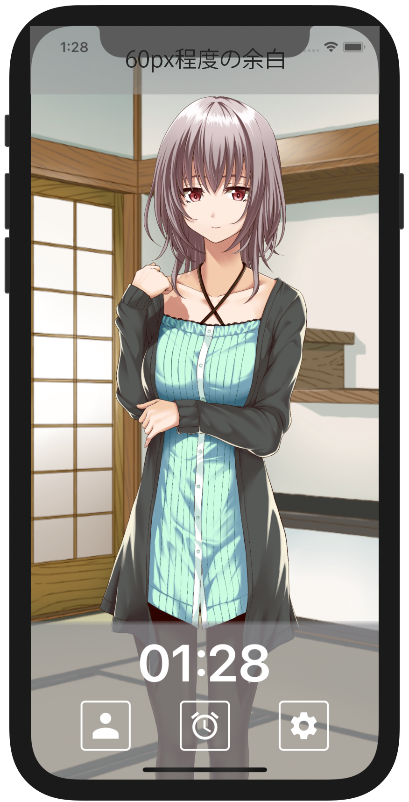
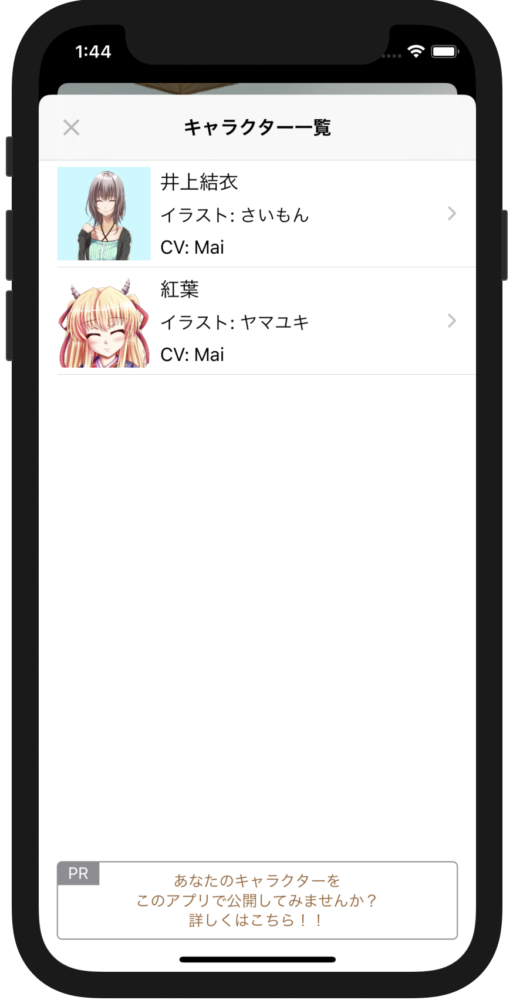
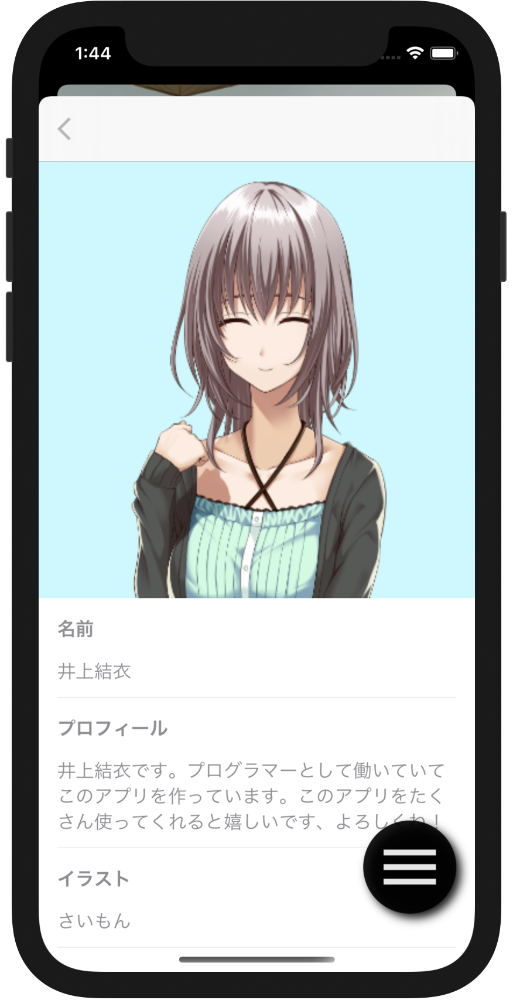

## キャラクターの追加に必要な素材

キャラクターの追加に必要な素材は以下の5種類です。
サムネイル画像は１種類、他の素材は最低１種類必要です。

- 立ち絵画像
- サムネイル画像
- タップボイス
- 自己紹介ボイス
- 着信時ボイス

このリポジトリで [井上結衣](https://github.com/takoikatakotako/charalarm/tree/main/resource/com.charalarm.yui) と [紅葉](https://github.com/takoikatakotako/charalarm/tree/main/resource/com.senpu-ki-soft.momiji) の素材を管理してますので、そちらも合わせてご参照ください。

### 立ち絵画像

立ち絵画像はキャラームのトップ画面に表示される画像です。
画面上部の60px程度の余白を除いた領域に合わせて画像が表示されます。
画像のアスペクト比は変わりません。
立ち絵画像の横幅は 1200px 以上 2000px 以下の 背景が透過済み png 画像をご用意ください。

### サムネイル画像

キャラクター選択画面、プロフィール画面で表示されるサムネイル画像です。
縦横が 500px 以下の正方形の png 画像をご用意ください。

### タップボイス

トップ画面でキャラクターがタップされた時に再生されるボイスです。
wav ファイルをご用意ください。

### 自己紹介ボイス

キャラクターがタップされた時に再生されるボイスです。
wav ファイルをご用意ください。

### 着信時ボイス

キャラクターから電話がかかってきた時に再生される音声です。
wav ファイルをご用意ください。

