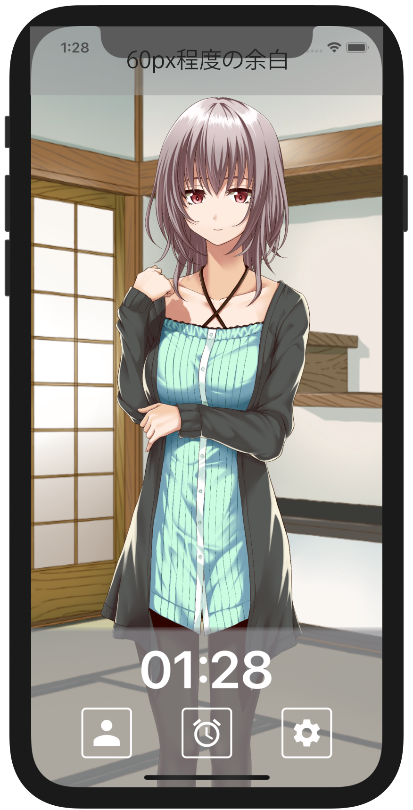
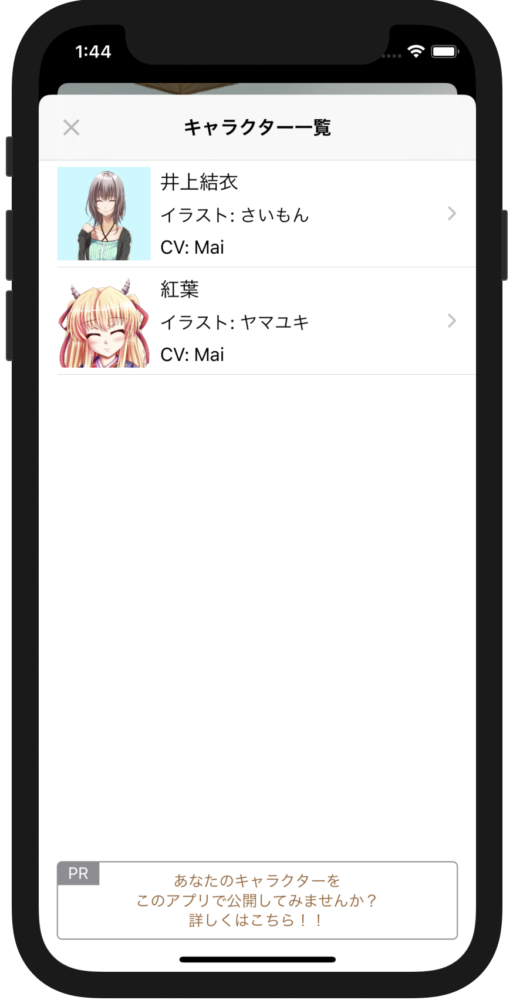
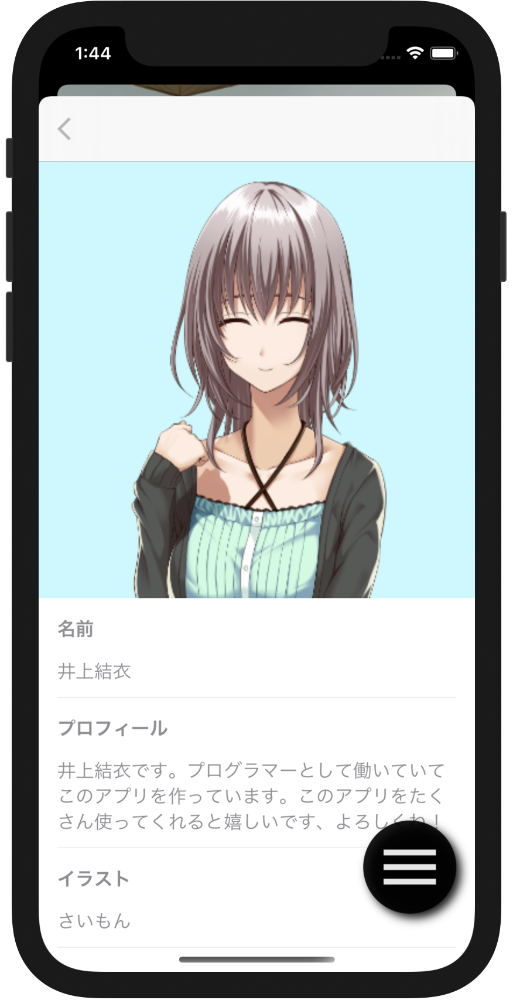

## Materials required to add characters

The following 5 types of materials are required to add a character.
One type of thumbnail image is required, and at least one type of other material is required.

- Standing picture image
- Thumbnail image
- Tap voice
- Self-introduction voice
- Incoming voice

Materials [井上結衣](https://github.com/takoikatakotako/charalarm/tree/main/resource/com.charalarm.yui) and [紅葉](https://github.com/takoikatakotako/charalarm/tree/main/resource/com.senpu-ki-soft.momiji) are managed in this repository, so please refer to that as well.

### Standing picture image

The standing picture image is the image displayed on the top screen of the character.
The image is displayed according to the area excluding the margin of about 60px at the top of the screen.
The aspect ratio of the image does not change.
The width of the standing picture image is 1200px or more and 2000px or less. Please prepare a png image with a transparent background.

### Thumbnail image

This is a thumbnail image displayed on the character selection screen and profile screen.
Please prepare a square png image with a height and width of 500px or less.

### Tap voice

This voice is played when the character is tapped on the top screen.
Please have your wav file ready.

### Self-introduction voice

The voice that plays when the character is tapped.
Please have your wav file ready.

### Incoming voice

This is the voice that is played when a call comes in from the character.
Please have your wav file ready.

