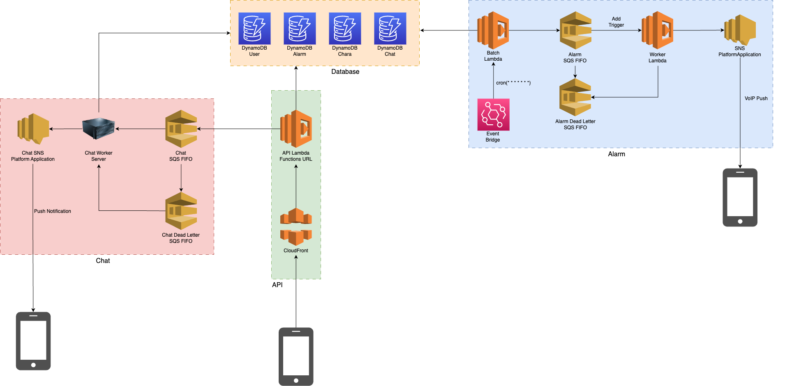
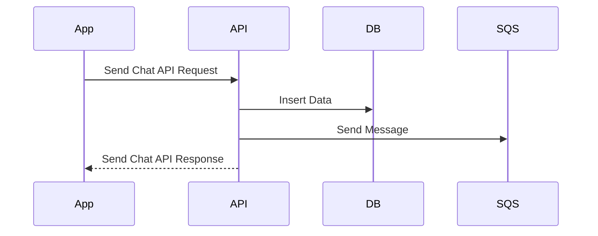
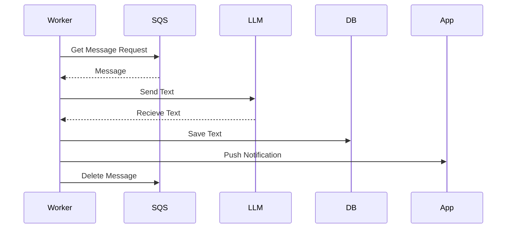

# システム

Charalarmのシステムは以下のサービスにより構成されています。

### API部

API部は API Gateway, Lambda, DynamoDB で構成されます。
モバイルアプリからのリクエストを受け、データを受け取ったり渡したりします。
DB には DynamoDB を使用しています。
本当は RDS を使いたいのですが、値段が。。。

### Batch部

Batch部は Event Bridge, Lambda で構成されます。
Batchは毎分起動します。
アラーム情報を格納している DynamoDB から時間になったアラームを取得し、加工してSQSにメッセージを送信します。

### Worker部

Worker部は SQS, Lambda, SNS で構成されます。
SQS からメッセージを取得し、プッシュ通知を送信します。

## Chat部

